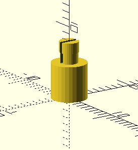

# Abstandshalter für Leiterplatten (Klippmontage)

## Status

gedruckt, getestet und für gut befunden

## Hinweise

- konstruiert mit [OpenSCAD](https://openscad.org/)
- i.d.R. werden vier Stück benötigt

## Vorschau

