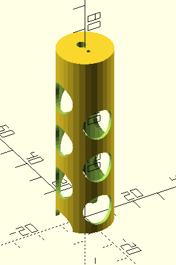
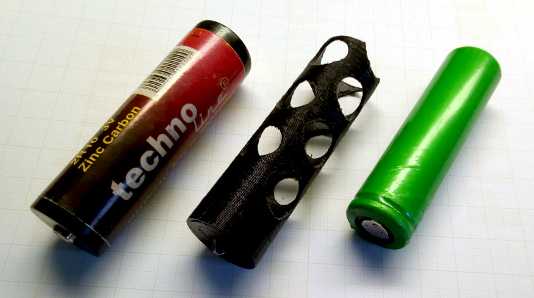

# Adapter für 2R10-Batterien (Duplex)

Da keine [2R10-Batterien](https://de.wikipedia.org/wiki/Duplex_%28Batterie%29) mehr erhältlich sind (Stand 05/2022), wurde dieser Adapter konstruiert, um stattdessen LiIon-Zellen der Größe 18650 verwenden zu können.
Um die Nennspannung (3V vs. 3,7V) etwas anzugleichen, wird in den Kopf des Adaptes eine bedrahtete Diode gesteckt.

## Status

gedruckt, getestet und für gut befunden

## Hinweise

- konstruiert mit [OpenSCAD](https://openscad.org/)
- sitzt relativ straff
- müßte hinten nicht so lang sein

## Vorschau

## Ausdruck
links: Zink-Kohle-Batterie Typ 2R10  
mitte: Adapter mit Diode  
rechts: LiIon-Zelle 18650  

