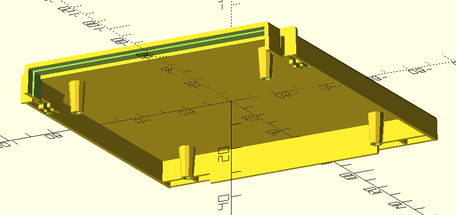
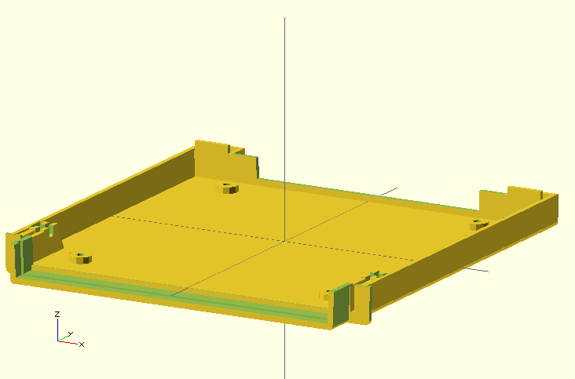
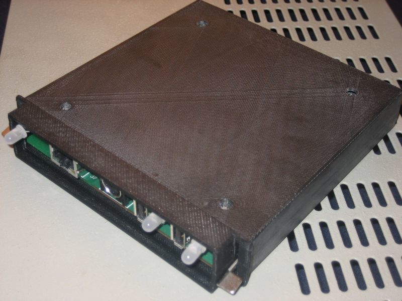

# Modulgehäuse für Kleincomputer aus Mühlhausen, KC85/2 bis KC85/5

## Status

works for me

## Hinweise

- konstruiert mit [OpenSCAD](https://openscad.org/)
- 3D-Objekt auch auf [Thingiverse](https://www.thingiverse.com/thing:2783113) verfügbar
- zweiteilig
- zusätzliche Ausbrüche im Oberteil für Modul M052-Netzwerk können in der .scad-Datei einkommentiert werden
- schwieriger Druck u.a. durch die abgesetzte Front
- Druck mit Stützmaterial
- weiters Zubehör erforderlich:
  * Modulblende
  * 4 Schrauben und 4 Muttern
  * Modulhebel
  * Nieten für Modulhebel

## Vorschau

## Ausdruck

