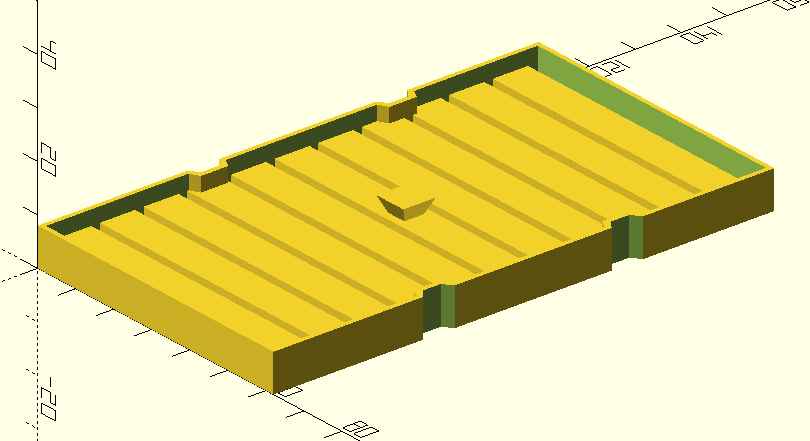
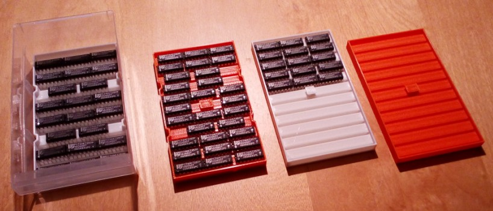

# Einsatz fürs Kleinteilemagazin

Um DIP-Schaltkreise geordnet unterzubringen.  
Es können vier Einsätze gestapelt werden. Da die Einschübe in der oberne Hälfte mehr Platz bieten, gibt es eine etwas kleinere Version für unten (2x) und eine größere für oben (2x).

## Status

gedruckt, getestet und für gut befunden

## Hinweise

- konstruiert mit [OpenSCAD](https://openscad.org/)

## Vorschau

## Ausdruck

