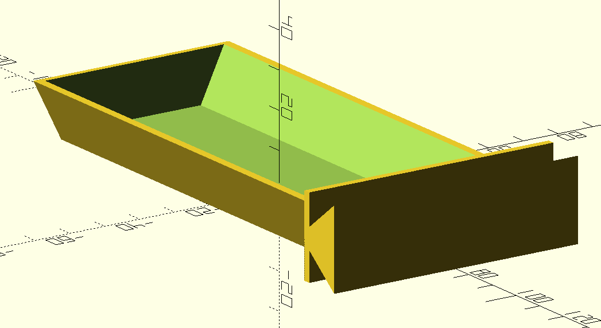
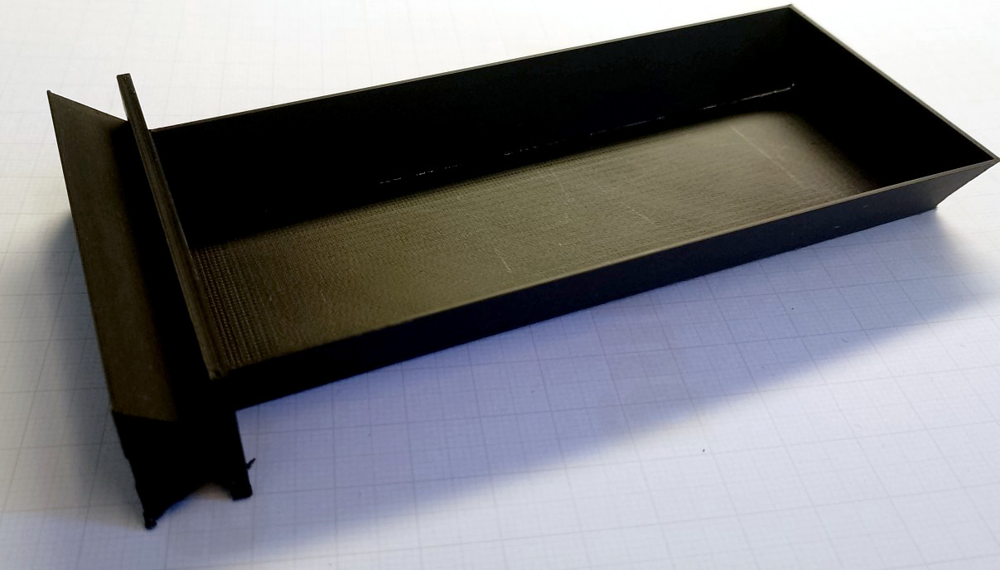

# Schublade für EPROM-Löschgerät Robotron K0421

## Status

gedruckt, getestet und für gut befunden
Die Haltbarkeit des Materials unter dem Einfluß der UV-Lampe muß noch ermittelt werden.

## Hinweise

- konstruiert mit [OpenSCAD](https://openscad.org/)

## Vorschau

## Ausdruck
Der Griff benötigt Stützstrukturen/Support.

