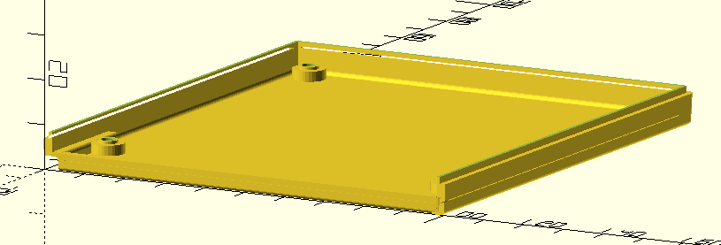

# Modulgehäuse für Robotron Kleincomputer Z9001, KC85/1 oder KC87

## Status

work in progress

## Hinweise

- konstruiert mit [OpenSCAD](https://openscad.org/)
- verwendet [scad-utils](https://github.com/OskarLinde/scad-utils)
- zweiteilig

## Vorschau

