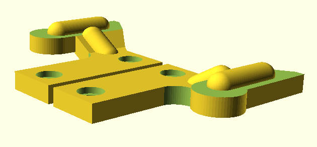
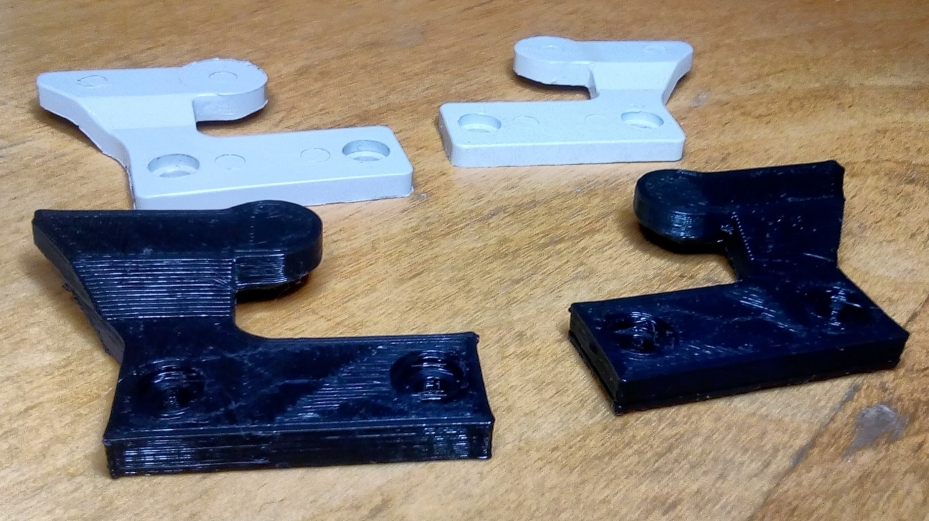

# Halterung für den Deckel einer Soemtron ETR220

Bei der elektronischen Rechenmaschine [Soemtron ETR 220](https://soemtron.org/soemtron220.html) werden die Deckelhalter aufgrund des Alters gern brüchig.

## Status

gedruckt, getestet und für gut befunden

## Hinweise

- konstruiert mit [OpenSCAD](https://openscad.org/)
- auf den Innenflächen wurde das Material verstärkt
- Druck - aufgrund der Form - mit Stützmaterial

## Vorschau
schon mit Verstärkung

## Ausdruck
noch ohne Verstärkung, hinten die Originalhalterung

