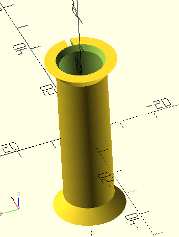
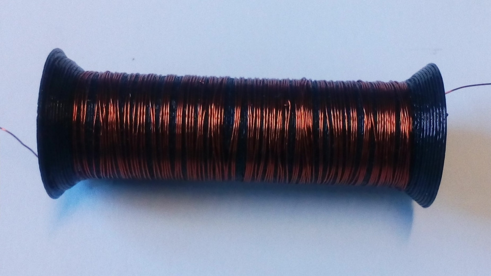
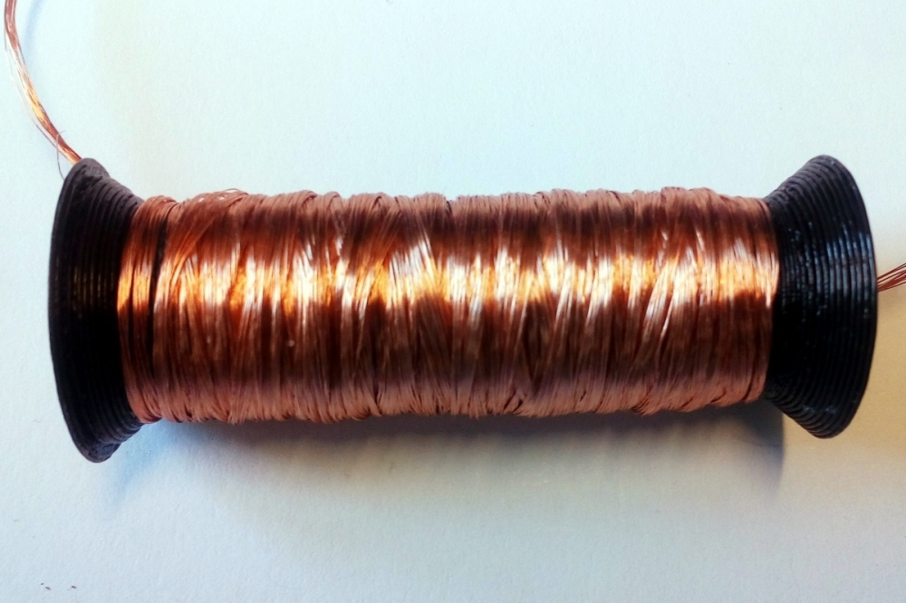

# Wickelkörker für Spulen mit Ferritkern

zur Bewickelung mit Draht oder HF-Litze

## Status

gedruckt, getestet und für gut befunden

## Hinweise

- konstruiert mit [OpenSCAD](https://openscad.org/)
- Länge: 45 mm
- Anpassung der Paramter in der .scad-Datei

## Vorschau

## Ausdruck
bewickelt mit Draht, Durchmesser 0,2 mm:

bewickelt mit HF-Litze:

